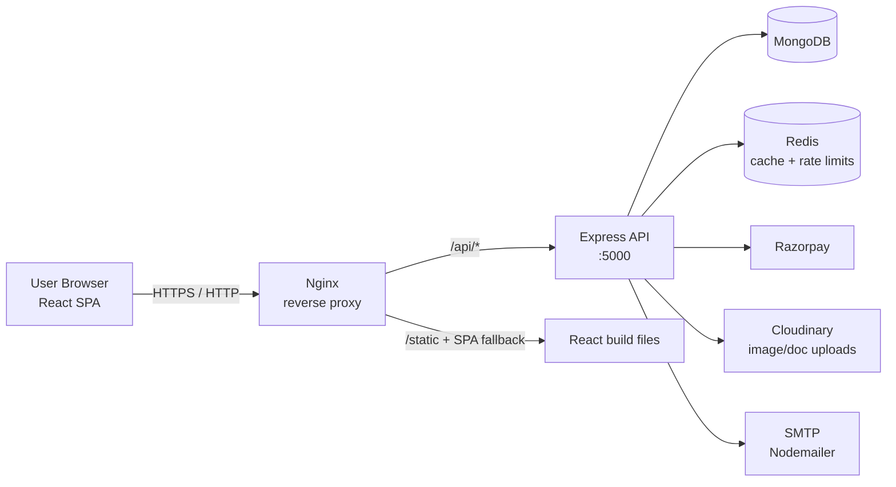
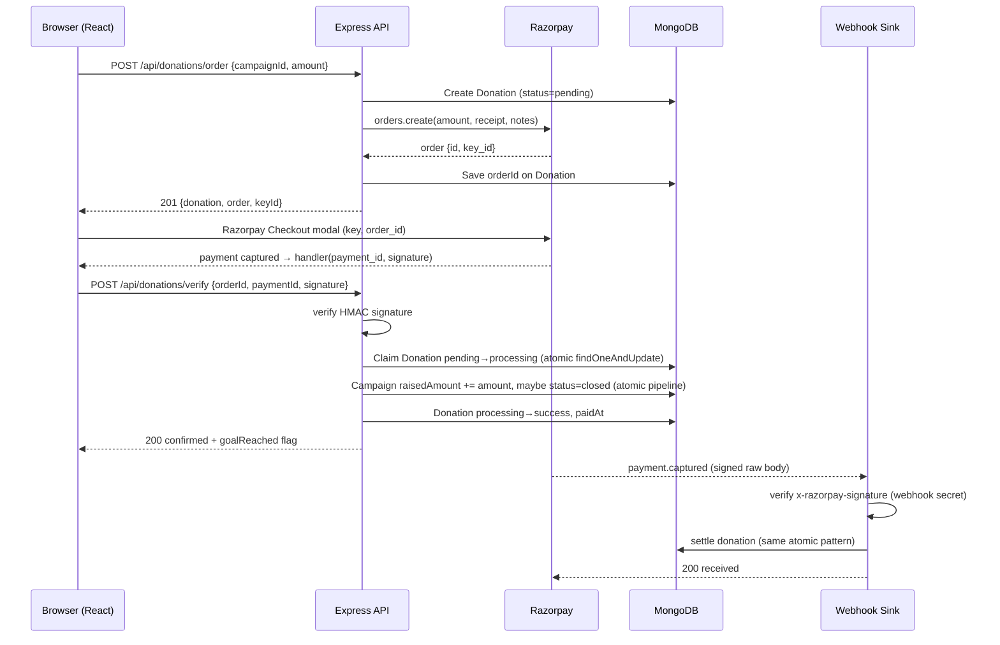

# CareConnect — Complete Technical Architecture & System Documentation

> **Project**: CareConnect — a campus crowdfunding platform for the NIT Raipur community.
> **Stack**: React 18 (SPA) + Express 4 (REST API) + MongoDB (Mongoose) + Redis + Razorpay (payments) + Cloudinary (media) + Nodemailer (email) + Nginx + Docker.
> **Purpose of this document**: Explain exactly how the project works end-to-end — from user registration to a donation payment via webhooks — plus every engineering concept used and what every file and method does.

---

## Table of Contents

1. [High-Level Architecture](#1-high-level-architecture)
2. [The Complete User Journey (Registration → Payment)](#2-the-complete-user-journey)
3. [Engineering Concepts Used](#3-engineering-concepts-used)
4. [Server-Side File-by-File Reference](#4-server-side-file-by-file-reference)
5. [Client-Side File-by-File Reference](#5-client-side-file-by-file-reference)
6. [API Endpoint Reference](#6-api-endpoint-reference)
7. [The Payment Lifecycle in Detail](#7-the-payment-lifecycle-in-detail)
8. [Webhooks in Detail](#8-webhooks-in-detail)
9. [Deployment & Infrastructure](#9-deployment--infrastructure)

---

## 1. High-Level Architecture

CareConnect is a **monorepo** containing two deployable units:

```
careconnect/
├── Frontend (React SPA)      ── served by Nginx
├── server/ (Express API)     ── talks to MongoDB, Redis, Razorpay, Cloudinary, SMTP
├── docker-compose.yml        ── orchestrates redis + mongo + api (locally)
└── Dockerfile / nginx.conf   ── frontend containerization + reverse proxy
```



### The moving parts

| Layer | Technology | Responsibility |
|---|---|---|
| **Frontend** | React 18 + react-router-dom + axios | UI, client state, Razorpay checkout modal |
| **Reverse proxy** | Nginx | Serves static React build, proxies `/api/*` to Express, gzip, security headers |
| **API** | Express 4 (ESM) | Business logic, auth, validation, payment orchestration |
| **Database** | MongoDB via Mongoose 8 | Users, campaigns, campaign requests, donations |
| **Cache / Rate-limit store** | Redis 7 via ioredis | Response caching, distributed rate limiting |
| **Payments** | Razorpay (REST + Webhooks) | Order creation, signature verification, captured-payment webhooks |
| **Media storage** | Cloudinary | Banner images + supporting documents (PDF/image) |
| **Email** | Nodemailer + SMTP | Campaign approved/rejected/stopped/goal-reached notifications |

---

## 2. The Complete User Journey (Registration → Payment)

This is the "movie" of the app. Two roles exist: **Student** (user) and **Admin**. A student can both create campaigns (as a fundraiser) and donate (as a donor).

### Step 0 — Boot

1. `docker-compose up` starts **Redis**, **MongoDB**, and the **API**.
2. The frontend is built (React) and served by Nginx, which proxies `/api/*` to the API container.
3. `server.js` calls `connectDatabase()` (MongoDB) and `connectRedis()`. Redis is optional — the API warns and continues if it is unavailable.
4. The API listens on port `5000`.

### Step 1 — Registration

1. User opens `/signup` → `src/Components/Singup.js` collects **name, email, password, confirmPassword**.
2. Client calls `register()` from `AuthContext`, which POSTs to `/api/auth/register`.
3. Server flow (`authController.register`):
   - **Email domain check**: email must end with `@<NIT_EMAIL_DOMAIN>` (default `nitrr.ac.in`). Otherwise **403**.
   - **Duplicate check**: `User.exists({ email })` → **409** if taken.
   - **Password hashing**: `bcrypt.hash(password, 12)` — 12 salt rounds.
   - **Create user** in MongoDB.
   - **Issue a JWT**: `createToken(user)` → signed with `JWT_SECRET`, 7-day expiry, `sub` = user id, `role` included.
   - **Set an httpOnly cookie** named `careconnect_token` via `setAuthCookie()`.
   - Responds **201** with the sanitized public user object.
4. Client stores the user in React context; the browser holds the httpOnly cookie automatically.

### Step 2 — Login (subsequent visits)

1. `/login` → `src/Components/Donor.js` posts to `/api/auth/login`.
2. `authController.login` fetches the user **with the password field** (`select('+password')`), compares with `bcrypt.compare`, and on success issues a new JWT cookie.
3. On every app load, `AuthContext` calls `/api/auth/me`, which verifies the cookie and returns the current user → session restore.

### Step 3 — AuthGuard

- `ProtectedRoute` blocks all app routes until the user is loaded; redirects to `/login` if no user.
- `AdminRoute` additionally checks `user.role === 'admin'`, else redirects to `/dashboard`.

### Step 4 — Creating a Campaign (Fundraiser flow)

1. User goes to `/create-campaign` → `src/Components/CreateCampaign.js`.
2. The form collects title, category, goal, deadline, contact number, description, reason, banner image (URL **or** file upload), supporting documents (≤5), and payout details (UPI/bank).
3. Client-side validation (`validate()`), then `buildPayload()`:
   - If no files → a plain JSON object.
   - If files → a `FormData` (multipart) object.
4. POSTs to `/api/campaigns/request` (or legacy `/api/campaign/request`).
5. Server chain on that route:
   - `requireAuth` → verifies the JWT cookie, loads the user, sets `req.user`.
   - `uploadCampaignFiles` (Multer) → parses multipart, enforces file type/size limits, puts files in memory.
   - `prepareCampaignRequestAssets` → uploads banner + docs to **Cloudinary**, converts any legacy `payoutDetails` into `bankDetails`, and replaces `req.body` URLs with trusted Cloudinary HTTPS URLs.
   - `validate(campaignRequestSchema)` (Zod) → full schema validation of the body.
   - `createCampaignRequest` → creates a **`CampaignRequest`** document with `status: 'pending'`.
   - Cache invalidation: `invalidateCache('campaigns:*')`.
6. User sees a "request submitted for review" screen with a reference ID.

### Step 5 — Admin Review & Approval

1. Admin opens `/admin` → `src/pages/AdminDashboard.js`, which calls `/api/admin/requests`, `/api/admin/campaigns`, `/api/admin/analytics` in parallel.
2. Admin clicks **View request** → `/api/admin/requests/:id`.
3. Admin clicks **Approve** → `PUT /api/admin/requests/:id/approve`:
   - Verifies the request is still `pending` (409 otherwise).
   - Validates deadline is still in the future (422 otherwise).
   - Creates a real **`Campaign`** document with `status: 'active'`, `approvedBy`, `approvedAt`.
   - Atomically updates the request to `approved` (guard against two admins approving at once — if the update fails, the just-created campaign is deleted).
   - Links the campaign to the user's `createdCampaigns`.
   - Sends an **approval email** to the creator (`sendCampaignStatusEmail`).
4. `rejectRequest` similarly flips the request to `rejected` with admin remarks + a rejection email.

### Step 6 — Browsing Campaigns (Donor flow)

1. `/dashboard` → `src/Components/Homepage.js` calls `GET /api/campaigns?page&limit&search&category&sort`.
2. Server: `listActiveCampaigns` — runs `refreshCampaignLifecycle()` (auto-closes expired/goal-reached campaigns), builds a filter (`status: 'active'`, future deadline, `raisedAmount < goalAmount`), supports full-text-ish search via escaped regex, pagination, and sorting (`newest` / `endingSoon` / `mostFunded`).
3. This route is cached in Redis for **120 s** (`cache({ ttl: 120, key: 'campaigns:list' })`) keyed by query string.
4. Clicking a campaign → `/campaigns/:id` → `GET /api/campaigns/:id` (cached 60 s), which returns the campaign with the creator populated and — for admins — the private `documents`, `upiId`, `bankDetails`.

### Step 7 — Donating (The Payment Flow)

1. On the campaign detail page (`CampaignDetail.js`), user clicks "Donate" → opens `DonationCheckout` modal.
2. User picks an amount → `startCheckout()`:
   - Client-side validation (₹1 – ₹10,00,000).
   - `POST /api/donations/order` with `{ campaignId, amount }`.
3. Server `createDonationOrder`:
   - `getPaymentProvider()` decides **Razorpay** (if keys configured) or **mock** (dev only).
   - Loads the campaign, checks it is still open (`active`, deadline not passed).
   - Creates a **`Donation`** document with `status: 'pending'` and a unique receipt.
   - Calls `createPaymentOrder()` on Razorpay → returns `order.id`.
   - Persists `orderId` on the donation; returns the public order (with the Razorpay **key_id** for the client).
   - On failure, marks donation `failed` and returns a **502**.
4. Client loads the Razorpay Checkout SDK script, opens the modal with `key`, `amount`, `order_id`, and a success `handler`.
5. User completes payment on Razorpay's hosted checkout.

### Step 8 — Verification (two independent paths)

There are **two** paths that confirm a payment — defense in depth:

**Path A — Client callback (`verifyDonationPayment`)**:
- Razorpay's `handler` fires with `razorpay_payment_id` + `razorpay_signature`.
- Client POSTs to `/api/donations/verify`.
- Server:
  - Finds the donation by `orderId` + current user.
  - Guards on state: already `success` → idempotent success response; `processing` → 409; `failed` → 409.
  - Verifies the **HMAC-SHA256 signature** (`verifyPaymentSignature`) using the orderId + paymentId + key secret.
  - **Claims the pending donation** (`findOneAndUpdate` on `{_id, status:'pending'}` → `processing`) — this is the concurrency guard that stops double-incrementing the campaign total.
  - **Atomically increments the campaign**: `Campaign.findOneAndUpdate` with an aggregation pipeline that adds the amount and flips `status → closed` if `raisedAmount >= goalAmount`.
  - Marks the donation `success`, records `paidAt`.
  - Adds the donation to the user's `donations` array.
  - If the goal was reached, emails the campaign creator.

**Path B — Razorpay Webhook (`handleRazorpayWebhook`)**:
- Razorpay POSTs a signed raw JSON body to `/api/payments/razorpay-webhook` (this route deliberately sits **before** the JSON body parser and uses `express.raw`, so the signature can be computed over the exact bytes).
- Server verifies the `x-razorpay-signature` HMAC using `RAZORPAY_WEBHOOK_SECRET`.
- Handles `payment.failed` (marks donation failed) and `payment.captured` (settles the donation, increments the campaign, emails the creator on goal reached).
- The webhook path matters when the browser tab closes before the callback completes.

### Step 9 — History & Tracking

- `GET /api/donations/history` → paginated list of the logged-in donor's donations (donation history in `ProfilePage` / donation pages).
- `GET /api/donations/campaign/:campaignId` → recent **successful** donations shown on the campaign page.
- `GET /api/my-campaigns` → the user's own campaigns + their request statuses.

### Step 10 — Admin Moderation of Live Campaigns

- `PUT /api/admin/campaigns/:id/stop` → stop accepting donations (emails creator).
- `PUT /api/admin/campaigns/:id/resume` → resume a stopped campaign (validates deadline & goal).
- `PATCH /api/admin/campaigns/:id` → edit title/goal/deadline.
- `DELETE /api/admin/campaigns/:id` → delete a campaign and clean up references.
- `GET /api/admin/analytics` → aggregate dashboard numbers via MongoDB `$group` pipelines.

---

## 3. Engineering Concepts Used

| Concept | Where it's used |
|---|---|
| **REST API design** | Every server route; resource-oriented endpoints with proper status codes |
| **JWT (stateless auth)** | `utils/token.js` — signed token, `sub` + `role` claims, 7-day expiry |
| **HttpOnly cookies** | `setAuthCookie` — token not readable by JS (XSS mitigation) |
| **bcrypt password hashing** | 12 rounds for registration & login |
| **Role-based access control (RBAC)** | `requireRole('admin')` middleware + `role` claim |
| **Middleware pipeline** | Express: helmet → cors → raw webhook → json → cookieParser → mongoSanitize → routes → 404 → error handler |
| **Input validation (Zod)** | `validation/campaignSchemas.js`, `validate` / `validateQuery` middleware |
| **NoSQL injection defense** | `express-mongo-sanitize` strips `$`/`.` from inputs; regex escaping in search |
| **Rate limiting** | `express-rate-limit` + `rate-limit-redis`; different limits per route group (auth 20, write 30, payment 20, admin 200, standard 150) |
| **Distributed caching** | Redis `cache()` middleware (TTL-based), `invalidateCache()` after mutations |
| **Graceful degradation** | Redis optional — app still works in-memory if Redis is down; SMTP optional — emails skipped with a warning |
| **Webhooks** | Razorpay `payment.captured` / `payment.failed` → raw-body parsing, HMAC signature verification |
| **Signature verification** | HMAC-SHA256 + `crypto.timingSafeEqual` (constant-time compare) |
| **Idempotency & concurrency control** | Status machine on donations (`pending → processing → success/failed`) + atomic `findOneAndUpdate` claims to prevent double credit |
| **Atomic database updates** | MongoDB aggregation pipeline in `findOneAndUpdate` to add funds and close campaign in one operation |
| **Materialized counters** | `raisedAmount` persisted on campaign (denormalized total) instead of recomputing |
| **Virtual fields** | `currentAmount` virtual alias for `raisedAmount` (client compatibility) |
| **Lifecycle automation** | Mongoose `pre('validate')` hook auto-closes goal-reached campaigns; `closeEligibleCampaigns` bulk sweeps expired/fully-funded campaigns |
| **Schema indexing** | Compound indexes on campaign/request/donation for fast queries |
| **Data hiding (field selection)** | `select: false` on `documents`, `upiId`, `bankDetails`, `paymentSignature`, `password` |
| **MVC pattern** | routes → controllers → services → models; client follows components/pages/api/auth/utils |
| **Upload streaming** | Multer memory storage → stream to Cloudinary upload stream |
| **SPA routing & code splitting** | `react-router-dom` v6 nested routes, `ProtectedRoute`/`AdminRoute` guards |
| **Context API** | `AuthContext` for global user state |
| **Debounced search** | Homepage search input debounced 280 ms with `AbortController` to cancel stale requests |
| **Controlled forms** | Every React form is fully controlled; validation both client & server side |
| **Environment-driven config** | `.env` via `dotenv/config`; fail-fast checks in `server.js` |
| **Containerization** | Multi-stage Dockerfiles, non-root user, healthchecks, `tini` init |
| **Reverse proxy** | Nginx SPA fallback, gzip, immutable static caching, `/api` proxying with forwarded headers |
| **Defense in depth for payments** | Client callback verification **and** server webhook verification |
| **Error handling** | Central error middleware; `next(error)` pattern; no leaked internals in production responses |
| **Loose coupling via providers** | `getPaymentProvider()` abstracts Razorpay vs mock; Cloudinary optional; SMTP optional |

---

## 4. Server-Side File-by-File Reference

### `server/src/server.js` — Entry point
- **Imports** `dotenv/config` (loads `.env`), the Express `app`, `connectDatabase`, `connectRedis`.
- **Fail-fast check**: throws if `MONGODB_URI` or `JWT_SECRET` is missing.
- **`start()`**: connects DB → tries Redis (logs warning and continues if it fails) → `app.listen(PORT || 5000)`.
- **`start().catch(...)`**: logs and exits on startup failure.

### `server/src/app.js` — Express application wiring
- Sets `trust proxy` (needed behind Nginx for correct client IPs).
- **Middleware order matters**:
  1. `helmet()` — security headers.
  2. `cors({ origin: CLIENT_ORIGIN, credentials: true })`.
  3. **Webhook route mounted BEFORE JSON parser** — uses `express.raw` so the raw body is available for signature verification; applies `webhookLimiter`.
  4. `express.json({ limit: '100kb' })`, `cookieParser()`, `mongoSanitize()`.
  5. `/api/health` — no rate limit.
  6. Route mounts with per-group limiters:
     - `/api/auth` → `authLimiter`
     - `/api/campaigns`, `/api/campaign` (legacy), `/api` (user) → `writeLimiter`
     - `/api/donations` → `paymentLimiter`
     - `/api/admin` → `adminLimiter`
     - fallback `/api` → `standardLimiter`
  7. 404 handler.
  8. Global error handler (handles `MulterError`, uses `error.statusCode`/`status`, hides internals for 5xx).

### `server/src/config/database.js`
- **`connectDatabase()`** — `mongoose.connect(MONGODB_URI)`.

### `server/src/config/redis.js`
- **`getRedisClient()`** — singleton `ioredis` client (lazy connect, retry strategy, event logging).
- **`connectRedis()`** — idempotent connect.
- **`disconnectRedis()`** — graceful quit.

### `server/src/config/cloudinary.js`
- **`isCloudinaryConfigured()`** — whether all 3 creds are set.
- **`getCloudinary()`** — configures and returns the Cloudinary SDK or throws a clear error.

### `server/src/config/rateLimiter.js`
- **`createLimiter(options)`** — wraps `express-rate-limit`; attaches a `RedisStore` when Redis is ready, otherwise falls back to the in-memory store.
- Exports limiters: `authLimiter` (20/15min), `standardLimiter` (150/15min), `writeLimiter` (30/15min), `paymentLimiter` (20/15min), `adminLimiter` (200/15min), `webhookLimiter`.

### `server/src/models/User.js`
- Schema fields: `name`, `email` (unique, lowercased), `password` (`select: false`), `role` (`user`/`admin`), `createdCampaigns[]`, `donations[]`. Timestamps on.

### `server/src/models/Campaign.js`
- Fields: `title`, `description`, `category`, `goalAmount`, `raisedAmount` (canonical total), `deadline`, `status` (`active|closed|rejected|stopped`), `creator`, `bannerImage`, and `select:false` private fields `documents`, `upiId`, `bankDetails`, `adminRemarks`.
- **Indexes**: `{status, deadline}`, `{creator, createdAt}`.
- **Virtual `currentAmount`** → aliases `raisedAmount`.
- **`pre('validate')` hook** → auto-`close` when `raisedAmount >= goalAmount`.
- **Static `closeEligibleCampaigns()`** → bulk-closes expired or fully funded campaigns.

### `server/src/models/Donation.js`
- Fields: `campaignId`, `donor`, `amount`, `currency` (INR), `paymentProvider` (`razorpay|mock`), `orderId` (unique sparse), `paymentId` (unique sparse), `paymentSignature` (`select:false`), `receipt`, `status` (`pending|processing|success|failed`), `failureReason`, `paidAt`.
- Indexes: `{donor, createdAt}`, `{campaignId, createdAt}`.
- `toJSON` transform strips `paymentSignature`/`__v`.

### `server/src/models/CampaignRequest.js`
- Embedded `campaignData` sub-schema (title, description, category, goal, deadline, banner, docs, upi/bank, contact, reason).
- Fields: `requestedBy`, `campaignData`, `status` (`pending|approved|rejected`), `adminRemarks`, `reviewedBy`, `reviewedAt`, `campaign` (link once approved).
- Indexes: `{status, createdAt}`, `{requestedBy, createdAt}`.

### `server/src/controllers/authController.js`
- **`register(req,res,next)`** — domain gate, duplicate check, bcrypt hash, create user, set cookie, 201.
- **`login(req,res,next)`** — fetch with password, bcrypt compare, set cookie.
- **`logout(_req,res)`** — clears cookie, 204.
- **`me(req,res)`** — returns `publicUser(req.user)`.
- **`updateProfile(req,res,next)`** — updates name, saves.

### `server/src/controllers/campaignController.js`
- **`prepareCampaignRequestAssets(req,_res,next)`** — maps legacy `payoutDetails`→`bankDetails`, uploads files to Cloudinary, normalizes `documents`.
- **`listActiveCampaigns(req,res,next)`** — lifecycle refresh, filtered/paginated/sorted list.
- **`getCampaign(req,res,next)`** — single campaign; admins get private fields.
- **`createCampaignRequest(req,res,next)`** — creates a pending `CampaignRequest`.
- **`listMyCampaigns(req,res,next)`** — user's campaigns + requests.
- Helpers: `campaignFilters()`, `escapedRegex()`, `refreshCampaignLifecycle()`, `sortMap`.

### `server/src/controllers/paymentController.js`
- **`createDonationOrder(req,res,next)`** — provider resolution, campaign open-check, create pending donation, Razorpay order, persist `orderId`, return public order (or 502 on failure).
- **`verifyDonationPayment(req,res,next)`** — the client-callback confirmation path (see [Section 7](#7-the-payment-lifecycle-in-detail)).
- **`getDonationHistory(req,res,next)`** — donor's paginated history.
- **`getCampaignDonationHistory(req,res,next)`** — a campaign's successful donations.
- Helpers: `publicOrder()`, `getDonationWithCampaign()`, `isCampaignOpen()`, `paginationFrom()`.

### `server/src/controllers/webhookController.js`
- **`handleRazorpayWebhook(req,res)`** — verifies HMAC signature, handles `payment.failed` and `payment.captured`, settles donations atomically, emails creator on goal reached. (See [Section 8](#8-webhooks-in-detail).)
- **`settleCapturedDonation(donation, payment)`** — atomic campaign increment + donation success + user link + goal email.

### `server/src/controllers/adminController.js`
- **`listRequests`** / **`getRequestDetails`** — pending/approved/rejected request management.
- **`approveRequest`** / **`rejectRequest`** — approve (creates live campaign + email) or reject (remarks + email).
- **`listAdminCampaigns`** / **`getAdminCampaignDetails`** — campaign management with private fields.
- **`updateCampaign`** / **`stopCampaign`** / **`resumeCampaign`** / **`deleteCampaign`** — moderation actions.
- **`getAnalytics`** — aggregated dashboard stats via `$group` pipelines.

### `server/src/services/paymentService.js`
- **`class PaymentConfigurationError`** — typed config errors → mapped to 503.
- **`getPaymentProvider()`** — returns `{ provider:'razorpay'|'mock', keyId, mode }`; enforces live-mode guards.
- **`createPaymentOrder({amount,currency,receipt,notes})`** — validates ≥ ₹1, creates mock or Razorpay order.
- **`verifyPaymentSignature(...)`** — HMAC-SHA256 over `orderId|paymentId`, constant-time compare.
- **`verifyWebhookSignature(rawBody, signature)`** — HMAC over raw body using webhook secret.

### `server/src/services/uploadService.js`
- **`uploadBuffer(file, options)`** — streams an in-memory buffer to Cloudinary.
- **`uploadCampaignAssets(files)`** — uploads banner + up to 5 docs in parallel; enforces size; 503 if Cloudinary not configured.

### `server/src/middleware/auth.js`
- **`requireAuth`** — reads cookie, verifies JWT, loads user, sets `req.user`.
- **`requireRole(...roles)`** — role gate (403).

### `server/src/middleware/upload.js`
- **`uploadCampaignFiles`** — Multer memory storage, field limits (1 banner, 5 docs, 6 files), MIME allow-lists, size caps (5 MB image / 8 MB doc).
- **`ensureUploadSize(file)`** — post-parse banner size enforcement.

### `server/src/middleware/validate.js`
- **`validate(schema)`** — Zod-validates `req.body`, replaces `req.body` with parsed result.
- **`validateQuery(schema)`** — Zod-validates `req.query` into `req.validatedQuery`.

### `server/src/middleware/cache.js`
- **`cache({ttl,key,skip})`** — Redis read-through cache; intercepts `res.json` to store bodies (<400), sets `X-Cache: HIT/MISS`.
- **`invalidateCache(pattern)`** — `KEYS` + `DEL` for a prefix pattern after mutations.

### `server/src/utils/token.js`
- **`createToken(user)`** — JWT sign (`sub`, `role`, expiry).
- **`setAuthCookie(res, token)`** — httpOnly, `secure` in prod, `sameSite: lax`, 7-day.
- **`publicUser(user)`** — whitelist: id, name, email, role.

### `server/src/utils/email.js`
- **`sendCampaignStatusEmail({type,...})`** — best-effort email; warns once if SMTP unconfigured; never throws into the caller.
- **`renderTemplate(...)`** — HTML email builder for `approved`, `rejected`, `goalReached`, `stopped` with HTML-escaping of user content.

### `server/src/validation/campaignSchemas.js`
- Zod schemas: `campaignRequestSchema`, `campaignDataPatchSchema`, `adminApprovalSchema`, `adminRemarksSchema`, `campaignListQuerySchema`, `adminRequestListQuerySchema`, `adminCampaignListQuerySchema`. Helpers: `futureDate`, `amount`, `optionalUrl`, `optionalText`.

### `server/src/routes/*.js` — Route tables
- **`authRoutes.js`** — `POST /register`, `POST /login`, `POST /logout`, `GET /me`, `PATCH /profile`.
- **`campaignRoutes.js`** — `GET /`, `POST /request`, `GET /my-campaigns`, `GET /mine`, `GET /:id`; plus `legacyCampaignRoutes` (`/api/campaign/*`) and `userCampaignRoutes` (`/api/my-campaigns`).
- **`donationRoutes.js`** — `POST /order`, `POST /verify`, `GET /history`, `GET /campaign/:campaignId`.
- **`adminRoutes.js`** — all under `requireAuth + requireRole('admin')`: analytics, requests (list/details/approve/reject), campaigns (list/details/patch/stop/resume/delete).

### `server/src/scripts/createAdmin.js`
- Reads `ADMIN_NAME/EMAIL/PASSWORD` from `.env`, enforces ≥12-char password, upserts an admin user (`findOneAndUpdate` with `upsert:true`).

---

## 5. Client-Side File-by-File Reference

### `src/index.js` — React entry
- Renders `<App/>` wrapped in `<AuthProvider>` (global auth state).

### `src/App.js` — Router table
- Public: `/login`, `/signup`.
- Protected (inside `ProtectedRoute` + `AppLayout`): `/dashboard`, `/campaigns/:id`, `/create-campaign`, `/my-campaigns`, `/profile`.
- Admin-only: `/admin`.
- Many legacy redirects (`/donor_login`, `/create_campaign`, `/donate`, etc.) → canonical paths.
- Catch-all → `/dashboard`.

### `src/api/client.js`
- Axios instance: `baseURL = REACT_APP_API_URL || http://localhost:5000/api`, `withCredentials: true` (so cookies flow), JSON content-type.

### `src/api/campaigns.js` — API wrapper module
- **`getCampaigns(params)`** — GET `/campaigns`.
- **`getCampaign(id)`** — GET `/campaigns/:id` with 404 fallback to `/campaign/:id`.
- **`createCampaignRequest(payload)`** — POST `/campaigns/request` (multipart aware) with fallback.
- **`getMyCampaigns()`** — GET `/my-campaigns`.
- **`createDonationOrder(payload)`** — POST `/donations/order`.
- **`verifyDonation(payload)`** — POST `/donations/verify`.
- **`getDonationHistory(params)`** — GET `/donations/history`.
- **`getCampaignDonationHistory(id, params)`** — GET `/donations/campaign/:id`.

### `src/auth/AuthContext.js`
- **`AuthProvider`** — holds `user`/`loading`; on mount calls `/auth/me`; exposes `login`, `register`, `logout`, `updateProfile`.
- **`useAuth()`** — context hook.

### `src/auth/ProtectedRoute.js` / `AdminRoute.js`
- Route guards: show loading, then render children or `<Navigate>`.

### `src/utils/campaigns.js`
- `CAMPAIGN_PLACEHOLDER`, `CATEGORY_LABELS`, `normalizeCampaign()`, `normaliseCampaignList()`, `getPagination()`, `formatCurrency()`, `formatDate()`, `getProgress()`, `getDaysLeft()`, `categoryLabel()`, `initials()`.

### `src/Components/SiteHeader.js`
- Global nav + profile popover; `handleLogout()` calls `logout()` then navigates to `/login`.

### `src/Components/Singup.js` — Registration form
- Validates password match; calls `register()`; navigates to `/dashboard`.

### `src/Components/Donor.js` — Login form
- Calls `login()`; navigates to `location.state.from` or `/dashboard`.

### `src/Components/Homepage.js` — Campaign list
- Debounced search (280 ms), category + sort filters, `AbortController` cleanup, server-side pagination when the API provides it, skeleton loading states.

### `src/Components/CampaignCard.js`
- Renders a campaign summary card (image, progress, days left, CTA).

### `src/Components/CreateCampaign.js` — Fundraiser form
- Controlled multi-section form, live progress %, file uploads, `buildPayload()` → JSON or `FormData`, `handleSubmit()` → `createCampaignRequest`, success screen with reference ID.

### `src/Components/DonationCheckout.js` — Payment modal
- **`loadRazorpay()`** — lazy-loads the Razorpay checkout script.
- **`startCheckout(event)`** — validates amount, `createDonationOrder`, opens the Razorpay modal (or the mock-payment UI), wires the `handler`.
- **`confirmPayment(order, paymentId, signature)`** — calls `verifyDonation`, shows the success screen with transaction ID, notifies parent.
- Preset amounts `[100,250,500,1000]`.

### `src/Components/Donationpage.js` / `DonationPage2.js` / `DonationPage3.js` / `DonationPage.js` / `Donor.css` etc.
- Legacy/alternate donation UI variants and styles (largely superseded by `DonationCheckout`).

### `src/Components/FundRaiser.js`, `CampaignCreators.js`, `Startingpage.js`
- Legacy landing / creator-focused views and styles.

### `src/pages/CampaignDetail.js` — Campaign page
- Loads campaign + donation history; `copyLink()`, progress/days-left computation, `canDonate` gate, admin payment-details section.

### `src/pages/MyCampaigns.js` — Creator's tracker
- Shows request statuses (pending/approved/rejected + reviewer note) and live/completed campaigns.

### `src/pages/ProfilePage.js`
- `submit()` → `updateProfile({name})`; read-only email + role.

### `src/pages/AdminDashboard.js` — Admin workspace
- **`load()`** — parallel fetch of requests/campaigns/analytics.
- **`openRequestDetails`** — modal with full request data + documents.
- **`runAction`** / **`approveRequest`** / **`rejectRequest`** — moderation PUTs with remarks prompts.
- **`saveEdit`** — PATCH campaign.
- **`deleteCampaign`** — confirm + DELETE.
- `Metric` / `Status` helper components.

---

## 6. API Endpoint Reference

| Method | Path | Auth | Rate Limit | Purpose |
|---|---|---|---|---|
| POST | `/api/auth/register` | – | auth | Register (NIT domain only) |
| POST | `/api/auth/login` | – | auth | Login, set JWT cookie |
| POST | `/api/auth/logout` | – | auth | Clear cookie |
| GET | `/api/auth/me` | ✓ | auth | Current user |
| PATCH | `/api/auth/profile` | ✓ | auth | Update name |
| GET | `/api/health` | – | none | Uptime probe |
| GET | `/api/campaigns` | – | write | Paginated active campaigns (cached) |
| GET | `/api/campaigns/:id` | optional | write | Campaign detail (cached) |
| POST | `/api/campaigns/request` | ✓ | write | Submit campaign request (multipart) |
| GET | `/api/my-campaigns` | ✓ | write | User's campaigns + requests |
| GET | `/api/campaign/:id` | optional | write | Legacy campaign detail |
| POST | `/api/campaign/request` | ✓ | write | Legacy request submit |
| POST | `/api/donations/order` | ✓ | payment | Create Razorpay/mock order |
| POST | `/api/donations/verify` | ✓ | payment | Verify client callback |
| GET | `/api/donations/history` | ✓ | payment | Donor's history |
| GET | `/api/donations/campaign/:campaignId` | ✓ | payment | Campaign's successful donations |
| POST | `/api/payments/razorpay-webhook` | webhook secret | webhook | Razorpay event sink (raw body) |
| GET | `/api/admin/analytics` | admin | admin | Dashboard aggregates |
| GET | `/api/admin/requests` | admin | admin | Request list |
| GET | `/api/admin/requests/:id` | admin | admin | Request detail |
| PUT | `/api/admin/requests/:id/approve` | admin | admin | Approve → create campaign |
| PUT | `/api/admin/requests/:id/reject` | admin | admin | Reject with remarks |
| GET | `/api/admin/campaigns` | admin | admin | Campaign list |
| GET | `/api/admin/campaigns/:id` | admin | admin | Campaign detail (private fields) |
| PATCH | `/api/admin/campaigns/:id` | admin | admin | Edit campaign |
| PUT | `/api/admin/campaigns/:id/stop` | admin | admin | Stop donations |
| PUT | `/api/admin/campaigns/:id/resume` | admin | admin | Resume campaign |
| DELETE | `/api/admin/campaigns/:id` | admin | admin | Delete campaign |

---

## 7. The Payment Lifecycle in Detail



### Why two confirmation paths?
- **Client callback** gives the user immediate feedback.
- **Webhook** guarantees correctness even if the user closes the tab, loses connectivity, or a malicious client skips the callback.
- Both paths are **idempotent**: the donation status machine (`pending → processing → success`) plus unique indexes on `paymentId` prevent a single charge being credited twice.

### Concurrency guarantees
1. `Donation.findOneAndUpdate({_id, status:'pending'}, {status:'processing'})` — only one request wins the claim.
2. `Campaign.findOneAndUpdate` with an aggregation `$set` pipeline — increment and status change are atomic at the document level.
3. Unique sparse index on `Donation.paymentId` — a successful gateway payment can't be replayed against a second donation.
4. Duplicate `orderId` for `createDonationOrder` — receipt is unique per user + timestamp.

---

## 8. Webhooks in Detail

### Why the route is special
```js
app.post('/api/payments/razorpay-webhook',
  webhookLimiter,
  express.raw({ type: 'application/json', limit: '100kb' }),
  handleRazorpayWebhook
);
```
- **`express.raw`**: Razorpay signs the **exact raw bytes** of the request body. If we used the JSON parser first (which may reformat whitespace), the signature would not match. So this route consumes the raw buffer before `express.json` is applied globally.
- **`webhookLimiter`**: protects the endpoint from abuse.

### Verification
`verifyWebhookSignature(rawBody, signature)` computes:
```
HMAC-SHA256(secret = RAZORPAY_WEBHOOK_SECRET, message = rawBody)
```
and compares with the `x-razorpay-signature` header using `crypto.timingSafeEqual` (constant-time, prevents timing attacks).

### Event handling
| Event | Action |
|---|---|
| `payment.failed` | Mark donation `failed` with `error_description` |
| `payment.captured` (status captured) | Find donation by `orderId`; verify amount (`payment.amount === donation.amount × 100`) and currency; claim `pending→processing`; `settleCapturedDonation()`: atomic campaign increment + auto-close, mark donation `success`, link to user's donations, email creator if goal reached |
| anything else | Acknowledge (`200 {received:true}`) without action — webhooks must always ACK to avoid retries |

### Security notes
- If the campaign is no longer active/expired, the webhook **reverts the donation to `pending`** (doesn't lose the money, but flags it for reconciliation).
- Errors return 4xx/5xx so Razorpay retries; config errors return 503.

---

## 9. Deployment & Infrastructure

### `docker-compose.yml` (local/dev)
- `redis` — redis:7-alpine with healthcheck and named volume.
- `mongo` — mongo:7 with healthcheck, init db `careconnect`, named volume.
- `api` — built from `server/Dockerfile`, port `5000`, `env_file`.
- Frontend is built from the root `Dockerfile` and served by Nginx.

### Root `Dockerfile` (frontend, multi-stage)
- **Stage 1 (builder)**: `node:20-alpine`, `npm ci --legacy-peer-deps`, `npm run build` → static assets.
- **Stage 2 (runtime)**: `nginx:1.27-alpine`, copies `nginx.conf`, copies build output to `/usr/share/nginx/html`, exposes 80, healthcheck, runs nginx.

### `server/Dockerfile` (backend)
- Builder installs deps; production stage prunes dev deps, installs `tini` + `curl`, runs as a **non-root user**, copies prod `node_modules` + `src`, exposes the API.

### `nginx.conf`
- Listens on 80; gzip for text/json/js/svg; security headers (`X-Frame-Options`, `nosniff`, `Referrer-Policy`).
- `/static/` → `expires 1y; Cache-Control: public, immutable` (hashed filenames).
- `/api/` → `proxy_pass http://api:5000` with `X-Forwarded-*` headers and timeouts.
- `/` → SPA fallback `try_files $uri $uri/ /index.html`.
- `~ /\.` → deny hidden files.

### Environment variables (`.env` on server/)
- `MONGODB_URI`, `JWT_SECRET`, `JWT_EXPIRES_IN`, `CLIENT_ORIGIN`, `NODE_ENV`, `PORT`, `NIT_EMAIL_DOMAIN`.
- `REDIS_URL`.
- `CLOUDINARY_CLOUD_NAME/API_KEY/API_SECRET`.
- `RAZORPAY_KEY_ID/KEY_SECRET`, `RAZORPAY_WEBHOOK_SECRET`, `RAZORPAY_LIVE_ENABLED`, `ALLOW_MOCK_PAYMENTS`.
- `MAIL_HOST/PORT/USER/PASS/FROM`.
- `ADMIN_NAME/EMAIL/PASSWORD` (for `npm run seed:admin`).

---

## Quick Start

```bash
# 1. Backend
cd server
npm install
cp .env.example .env        # fill in secrets
npm run seed:admin          # create the admin account
npm run dev                 # API on :5000

# 2. Frontend
cd ..
npm install
npm start                   # React dev server on :3000 (proxy /api via REACT_APP_API_URL)

# 3. Or run everything with Docker
docker-compose up --build
```

---

*This document is generated from the actual source code of the repository and reflects the implementation as-is.*
